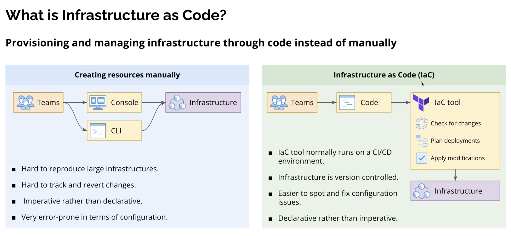

## What Is Infrastructure as Code (IaC)?

Infrastructure as Code (IaC) is a way of **managing and provisioning infrastructure using code** instead of doing everything manually in a UI or with ad‑hoc scripts. You describe servers, networks, and services in configuration files, and tools like Terraform use those files to create and update real infrastructure in a repeatable, version-controlled way.

### Visual Overview

