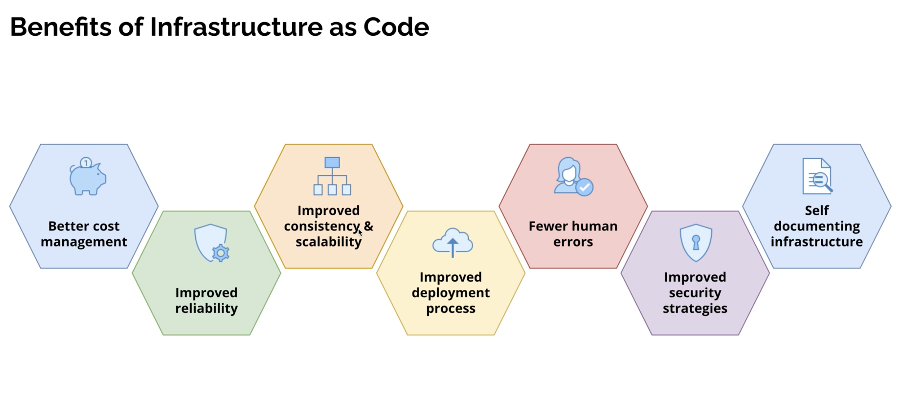

## Benefits of Infrastructure as Code (IaC)

Infrastructure as Code (IaC) brings software engineering practices to infrastructure, making it **faster, safer, and more consistent** to manage environments.

- **Consistency and repeatability**: The same code can be applied again and again to create identical environments (dev, stage, prod).
- **Version control**: Infrastructure definitions live in Git, so changes are tracked, reviewable, and auditable.
- **Automation and speed**: Provisioning becomes automated, reducing manual steps and human error.
- **Collaboration**: Teams can work together on infrastructure the same way they work on application code.
- **Documentation by default**: The code itself becomes living documentation of how infrastructure is built.

### Visual overview

