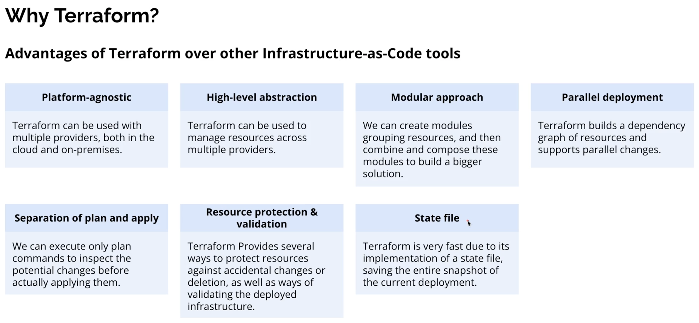

## Why Terraform?

Terraform is an **Infrastructure as Code (IaC)** tool that uses **declarative configuration files** to describe the desired state of your infrastructure. It is cloud-agnostic, so the same tool and language can be used across AWS, Azure, GCP, and many other providers.

### Why choose Terraform?

- **Multi-cloud**: Manage resources across different cloud providers with one tool and one language (HCL).
- **Declarative**: You describe *what* you want, and Terraform figures out *how* to get there.
- **Repeatable and versioned**: Infrastructure lives in code, so it can be reviewed, tested, and version-controlled.
- **Modular**: Reusable modules make it easy to standardize infrastructure patterns across teams and projects.
- **Large ecosystem**: Many official and community providers and modules are available.

### Visual overview

