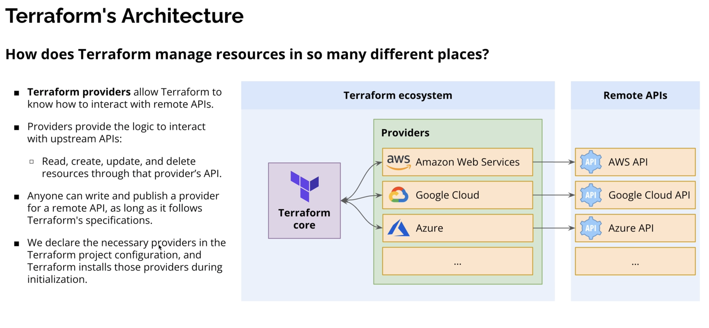

## Terraform Architecture

Terraform has a **client-side architecture** centered around the Terraform CLI, which reads configuration files, builds a dependency graph, and coordinates changes to your infrastructure through providers and state.

### Main components

- **Configuration files (`*.tf`)**: Describe the desired state (resources, variables, modules, outputs).
- **Terraform Core (CLI)**: Parses configs, builds the dependency graph, creates the plan, and applies changes.
- **Providers**: Plugins that talk to external APIs (clouds, SaaS, on-prem systems).
- **State**: Snapshot of real resources that maps Terraform configuration to actual infrastructure.
- **Backends**: Where the state is stored (local file, S3, GCS, Terraform Cloud, etc.).

### Visual overview

