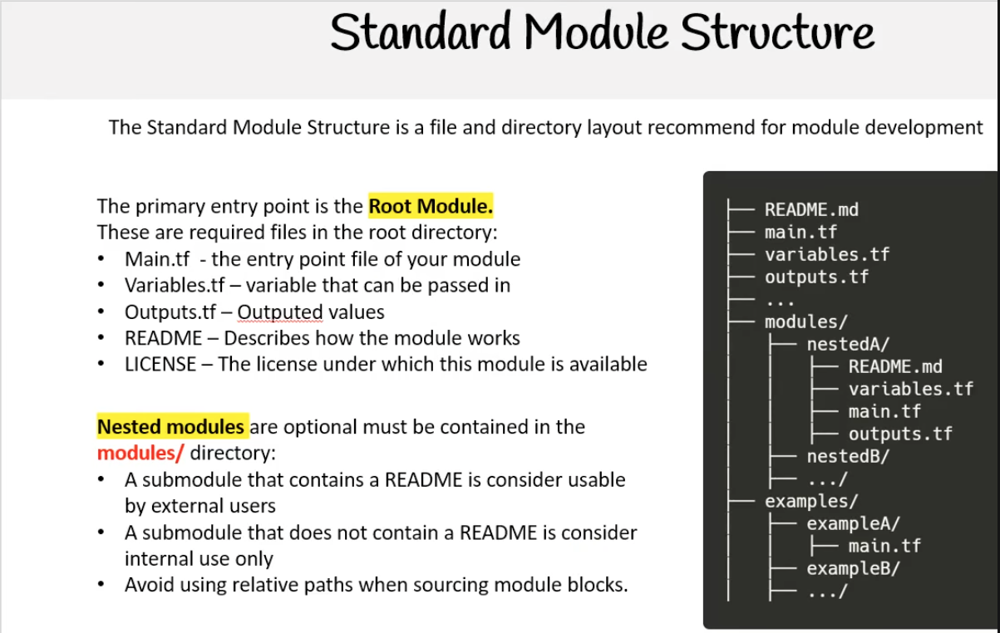

## Standard Module Structure

The standard Terraform module structure is a **recommended file and directory layout** that makes modules easy to understand, reuse, and share.

### Root module (top-level)

These files usually live in the root of the module:

- **`main.tf`**: Entry point of your module; defines resources and data sources.
- **`variables.tf`**: Input variables that callers can pass into the module.
- **`outputs.tf`**: Output values that the module returns.
- **`README.md`**: Explains how the module works and how to use it.
- **`LICENSE`**: License under which the module is available (optional but recommended).

### Nested modules

Nested or child modules are **optional**, but when you use them they should be contained in a `modules/` directory:

- Each nested module lives in its own subfolder under `modules/`.
- A submodule that has a `README.md` is meant for external reuse.
- A submodule without a `README.md` is typically for internal use only.
- Avoid using relative paths when sourcing module blocks from far away locations.

### Simple directory diagram

```text
root-module/
├── main.tf
├── variables.tf
├── outputs.tf
├── README.md
├── LICENSE
└── modules/
    ├── nestedA/
    │   ├── main.tf
    │   ├── variables.tf
    │   ├── outputs.tf
    │   └── README.md
    └── nestedB/
        ├── main.tf
        ├── variables.tf
        └── outputs.tf
```

### Visual overview



