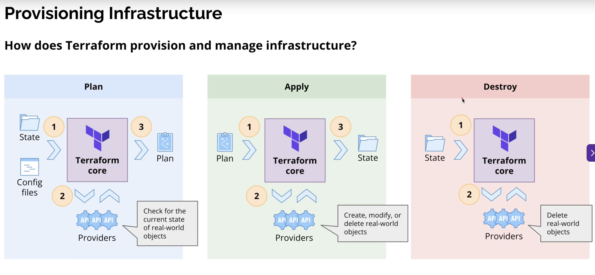

## Provisioning Infrastructure with Terraform

Terraform provisions and manages infrastructure by comparing your **desired state** (written in configuration files) with the **current state** of real resources, then creating a plan and applying only the required changes.

### Main phases

- **Plan**: Terraform core reads state and config files, asks providers for the current real-world state, and creates a plan of actions.
- **Apply**: Terraform core uses providers to create, update, or delete real-world objects according to the plan.
- **Destroy**: Terraform core and providers remove real-world resources when they are no longer needed.

### Visual overview

