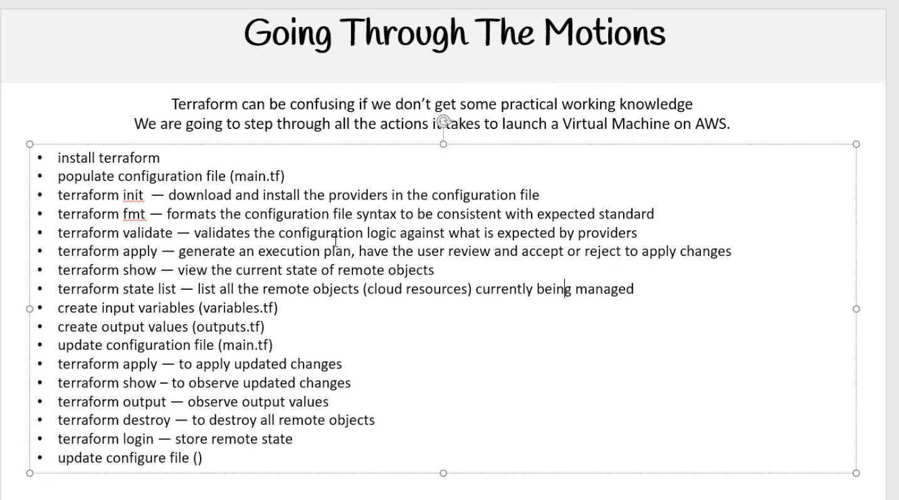

## Terraform Commands

### Core Workflow

- **`terraform init`**: Initialize your Terraform working directory and download required providers/modules.
- **`terraform plan`**: Show what actions Terraform will take to reach the desired state.
- **`terraform plan -out <my-plan>`**: Create a plan and save it into a file (binary plan).
- **`terraform apply`**: Apply all changes from a plan; asks for confirmation before running.
- **`terraform apply --auto-approve`**: Apply changes **without** asking for confirmation.
- **`terraform apply <my-plan>`**: Apply a previously saved plan file **without** approval prompt.

### Inspecting State and Plans

- **`terraform show`**: Show the current state in a human-readable format.
- **`terraform show <my-plan>`**: Show a saved plan file (`<my-plan>`) in a human-readable format.
- **`terraform state list`**: List all resources in the current Terraform state.

### Other Useful Commands

- **`terraform fmt`**: Automatically format Terraform configuration files to the canonical style.
- **`terraform validate`**: Validate configuration files for syntax and internal consistency.
- **`terraform destroy`**: Destroy all managed infrastructure (asks for confirmation).
- **`terraform output`**: Show the values of defined outputs from the current state.
- **`terraform login`**: Authenticate to a remote Terraform service (for example Terraform Cloud) and store credentials for remote state.

### Visual overview

