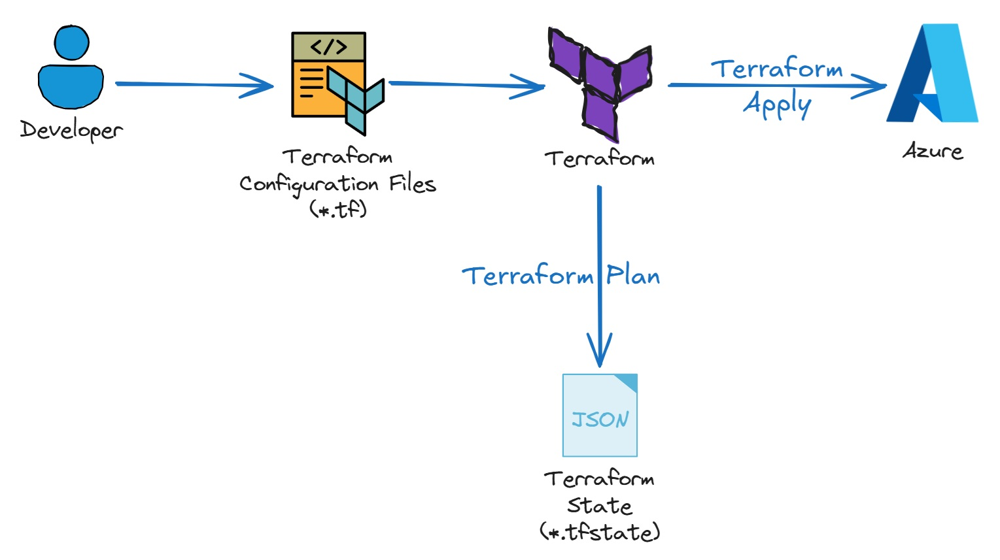

## Terraform State

Terraform **state** is a file (or data stored remotely) that records the mapping between the resources in your configuration and the real infrastructure objects in the cloud or other providers. Terraform uses this state to plan changes and keep your infrastructure in sync with your code.

### Why state is needed

- **Identity mapping**: Terraform must know which real resource corresponds to each `resource` block in your configuration.
- **Tracking attributes**: Some attributes (for example, IDs or IPs) are only known after creation; state stores them so Terraform can use them later.
- **Drift detection**: State lets Terraform compare the desired state (config) with the current state (real resources) during `plan` and `apply`.

### Local vs remote state

- **Local state**: A file named `terraform.tfstate` in the project directory. Simple for solo use, but not suitable for teams.
- **Remote state**: State stored in a backend (S3, GCS, Terraform Cloud, etc.). Enables teamwork, locking, and versioning.

### Important points

- **Do not edit state by hand**; use `terraform state` subcommands if needed.
- **Back up state** if using local storage; remote backends often handle this.
- **Use state locking** when using remote backends to avoid concurrent changes corrupting state.

