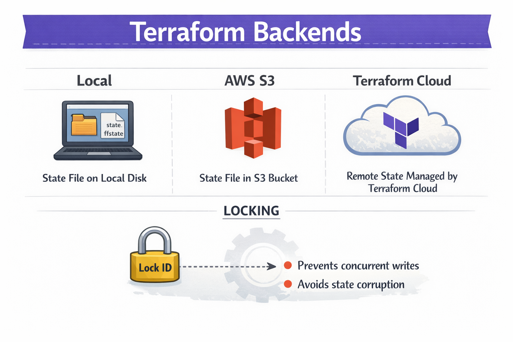

## Terraform Backends

A **backend** defines where Terraform stores its state file. By default, state is stored locally; a backend lets you store it remotely (for example in S3 or Terraform Cloud), which supports teams and workflows like CI/CD.

### Backend types

- **Local**: State is stored in a file (e.g. `terraform.tfstate`) on your machine. Simple for solo use, but not ideal for teams.
- **AWS S3**: State is stored in an S3 bucket. Common choice for AWS workloads; often used with DynamoDB for locking.
- **Terraform Cloud**: State is stored and managed by Terraform Cloud (or Terraform Enterprise). Includes built-in locking, versioning, and collaboration features.

### State file locking

When using remote backends, **state locking** prevents multiple users or pipelines from changing state at the same time:

- **Prevents concurrent writes** so only one `apply` or `plan` can modify state at once.
- **Avoids state corruption** from overlapping changes.

Backends like S3 (with DynamoDB), GCS, and Terraform Cloud support locking automatically; local backends do not.

### Visual overview

