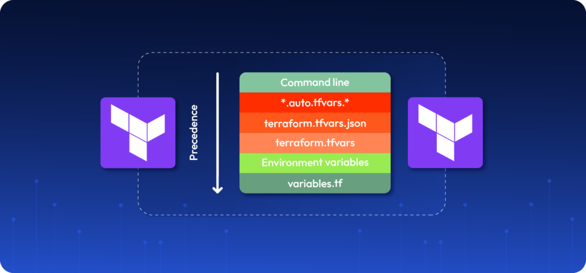

# Locals

Locals are named values you define once and reuse across your configuration. Unlike variables, they cannot be set from outside — they are internal to your module.
```hcl
locals {
  env    = "prod"
  prefix = "myapp-${local.env}"
}
```

Use them with `local.<name>`:
```hcl
resource "aws_s3_bucket" "this" {
  bucket = local.prefix
}
```

> 📌 Locals are not inputs and not outputs — they are just internal shortcuts to avoid repetition.


# Terraform Variables — Rules & Priority

## 1. Variable Declaration

Variables must be declared with a `variable` block.
```hcl
variable "instance_type" {
  type = string
}
```

> ⚠️ Value sources cannot create new variables. They can only assign values.

---

## 2. Ways to Set Variable Values

Terraform variables can be set from several places:

- Default value in `variables.tf`
- `terraform.tfvars`
- `*.auto.tfvars`
- CLI `-var-file`
- CLI `-var`
- Environment variables `TF_VAR_name`

**Example:**
```bash
export TF_VAR_instance_type="t3.micro"
```

---

## 3. Variable Priority (Highest → Lowest)

| Priority | Source |
|----------|--------|
| 1 *(highest)* | CLI (`-var` and `-var-file`) |
| 2 | `*.auto.tfvars` |
| 3 | `terraform.tfvars` |
| 4 | Environment variables `TF_VAR_name` |
| 5 *(lowest)* | `default` value in variable block |

> 🔼 Higher priority overrides lower priority values.

---

## 4. Override Rule

Terraform does **not** replace all variables — it only overrides **matching** ones.

**Example:**

`terraform.tfvars`
```hcl
instance_type = "t3.micro"
env           = "dev"
```

`override.auto.tfvars`
```hcl
instance_type = "t3.medium"
```

**Result:**
```hcl
instance_type = "t3.medium"   # ← overridden
env           = "dev"          # ← unchanged
```

---

## 5. Multiple `.auto.tfvars` Files

Terraform loads all `*.auto.tfvars` files automatically in **alphabetical order**.
```
01-base.auto.tfvars
02-prod.auto.tfvars
```

> 📌 Later files override earlier ones.

---

## 6. Missing Variable Value

If a variable has no `default` and no provided value, Terraform will prompt:
```
var.instance_type
  Enter a value:
```

---

## 7. CLI Variable Priority Rule

> When using multiple CLI variable sources (`-var`, `-var-file`),
> Terraform applies them in the **order they are written** — later arguments override earlier ones.

---

### Example

**`-var` before `-var-file` → file wins:**
```bash
terraform plan -var="x=1" -var-file="a.tfvars"
```
```hcl
x = value from a.tfvars   # ← a.tfvars came last, so it wins
```

**`-var-file` before `-var` → explicit value wins:**
```bash
terraform plan -var-file="a.tfvars" -var="x=1"
```
```hcl
x = 1   # ← -var came last, so it wins
```

---

### Summary
```
CLI variables are processed left → right.
Later values override earlier ones.
```

| Order | Winner |
|-------|--------|
| `-var` then `-var-file` | `-var-file` |
| `-var-file` then `-var` | `-var` |

---

## Summary

| Concept | Description |
|---------|-------------|
| `variable` block | Declares a variable |
| Value sources | Assign values to declared variables |
| Higher priority | Overrides lower priority values |
| Override behavior | Only **matching** variables are overridden |

---

## Priority Diagram
```
        Highest Priority
               │
               ▼
    ┌──────────────────────────┐
    │  CLI (-var, -var-file)   │
    ├──────────────────────────┤
    │      *.auto.tfvars       │
    ├──────────────────────────┤
    │     terraform.tfvars     │
    ├──────────────────────────┤
    │    TF_VAR_name (env)     │
    ├──────────────────────────┤
    │      variable default    │
    └──────────────────────────┘
               │
               ▼
        Lowest Priority


  ✅ Higher level overrides lower level values
  ✅ Only matching variables are overridden
```


## 8. Outputs

Outputs display values after `terraform apply`. They can be marked as sensitive to suppress terminal output.
```hcl
output "db_password" {
  value     = var.db_password
  sensitive = true
}
```

> ⚠️ `sensitive = true` **only** hides the value in terminal output — it does **not** encrypt or protect it elsewhere.

| Location | Visible? |
|----------|----------|
| Terminal output | ❌ Hidden |
| `terraform output <name>` | ✅ Visible |
| `.tfstate` file | ✅ Visible (plain text) |

---

## 9. Sensitive Variables

If a variable is marked `sensitive = true`, Terraform will **refuse** to expose it through an output block unless the output is also marked `sensitive = true`.
```hcl
variable "db_password" {
  type      = string
  sensitive = true
}
```

Trying to output it without `sensitive = true`:
```hcl
output "db_password" {
  value = var.db_password   # ← ❌ throws error
}
```
```
Error: Output refers to sensitive values
```

**Fix — mark the output as sensitive too:**
```hcl
output "db_password" {
  value     = var.db_password
  sensitive = true            # ← ✅ required
}
```

---

### Summary

| Concept | Behavior |
|---------|----------|
| `sensitive = true` on output | Hides value in terminal only |
| `.tfstate` file | Always stores values in plain text |
| `terraform output <name>` | Always prints the value |
| `sensitive = true` on variable | Output block **must** also be marked sensitive |


